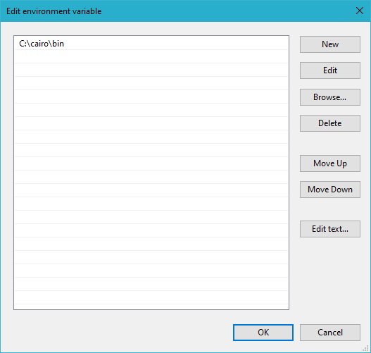

# Getting started

* [Harbour programming language](https://en.wikipedia.org/wiki/Harbour_(programming_language))
* [Homepage](https://harbour.github.io)
* Repository:
   - [hb30](https://sourceforge.net/projects/harbour-project/files/)
   - [hb32](https://github.com/harbour/core)
   - [hb34](https://github.com/vszakats/harbour-core)

#  mingw-w64-cairo

Download binaries **Cairo** from this project and install:

``` batch

c:\>

```

Install the rest of the missing libraries in mingw-w64

``` batch

c:\>mingw-w64

```


Click New to create a new environment variable. Click Edit to modify an existing environment variable.


After creating or modifying the environment variable, click OK to have the change take effect.

The Edit environment variable UI will appear. Here, you can click New and type in the new path you want to add. From this screen you can also edit or reorder them.



> Note: The graphical user interface for creating environment variables may vary slightly, depending on your version of Windows.

For the record:

``` batch

c:\>set HB_WITH_CAIRO=C:\cairo\include
c:\>set PATH=C:\cairo\bin;%PATH%

```

##

[Edit me](https://github.com/rjopek/hb-cairo/edit/main/docs/tutorial/README.md)
